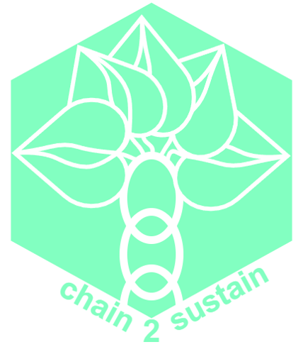

# Chain2Sustain

## Team Information 
### Team Members
| Name |
|---|
| David Gasser |
| Mehmet Eren Turanboy |
| Felix Myhsok |

## Project Information
- The developed chaincode can be founde in the `chaincodes/` directory. 
- The NodeJS Client Application can be found in the `client/` directory.
- Follow the instructions in the `doc/fablo-network/README.md` to start the a fablo network.
- Additional documentation alongside with figures created during the project can be found in the `doc/` directory.

## Report
[Final Report (PDF)](DLT4PI___Final_Report.pdf)

## Additional Information
|Topic| Link |
|---|---|
| Scalability | https://www.ibm.com/blog/does-hyperledger-fabric-perform-at-scale/ |
| Miro | https://miro.com/welcomeonboard/YjZWOW90T05PNGZzc3laZ0h2TmVUTjd2SlRqMHU0Wkk5TEV6RUNuWEM2R2FwdVY4OGhIQmJGWEhPWlVFMVNzZnwzMDc0NDU3MzUyOTM0ODI5MDUxfDI=?share_link_id=172309816148 | 
