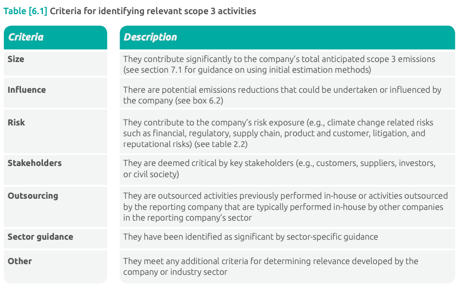

# Certification Process

## Sustainability reporting standard
- [GRI Website](https://www.globalreporting.org/standards/media/1684/german-gri-305-emissions-2016.pdf)
- Combines multible standards 

- Certified Attributes
  - **Management Style** needs to be reported about
    - Emissions
    - Usage of offsets (?)
    - + show which regulations the company needs to comply to at each location
    - + Spendings on procedures about emission reduction and certificates
  - Seperate listings about **Direct THG Emissions**, **Indirect THG Emissions**, and **miscellaneous Indirect THG Emissions**
    - Bruttovolumen der direkten/indirekten THG‐Emissionen (Scope 1) in Tonnen CO2‐Äquivalent
    - in die Berechnung einbezogene Gase; entweder CO2, CH4, N2O, FKW, PFKW, SF6, NF3 oder alle
    - biogene CO2‐Emissionen in Tonnen CO2‐Äquivalent
    - das gegebenenfalls für die Berechnung gewählte Basisjahr
    -  Quelle der Emissionsfaktoren und der verwendeten Werte für das globale Erwärmungspotenzial (Global Warming Potential, GWP) oder einen Verweis auf die GWP‐Quelle
    -  Konsolidierungsansatz für Emissionen; ob Equity‐Share‐Ansatz, finanzielle oder operative Kontrolle
    -  verwendete Standards, Methodiken, Annahmen und/oder verwendete Rechenprogramme
  - **Intensity of the THG Emissions**
  - **Reduction of the THG Emissions**
  - **Emissions of Ozon reducing substances**
  - **Nitrogen oxide, sulphur oxides and other significant air emissions**

## Greenhouse Gas Protocol - Value Chain Accounting and Reporting Standard
- [Standard](https://ghgprotocol.org/sites/default/files/standards/Corporate-Value-Chain-Accounting-Reporing-Standard_041613_2.pdf)

- Defines different scopes 
  - scope 3 emissions should not be aggregated across companies to determine total emissions in a given region (because of double counting)
- Defines organizational boundaries
  - Equity share approach
  - Financial control approach
  - **Operational control approach** (makes most sense for us)
- Scope 3 emissions are devided into 
  - upstream emissions
  - downstream emissions
  - 
  - 
  - 
- Collecting Data
  - Information on how to calculate Scope 3 emissions in a (seperate document)[https://ghgprotocol.org/scope-3-calculation-guidance-2] 
  - Quantification Methods: (GWP == Global Warming Potential)
    - Direct Measurement: GHG = Emissions Data x GWP
    - Calculation: Activity Data x Emission Factor x GWP
  - 
  - 
  - at the top 80% of contributing tier 1 suppliers should be prioritized for data collection
  - 
  - 
  
  ## VW RAW MATERIAL DUE DILIGENCE MANAGEMENT SYSTEM
  - cooperation with NGOs focusing the protection of human rights
  - Grievance Mechanism 
  - list of smelters, refiners, and countries of origin 3TG supply chains
  - comprehensive sustainability audit against the CERA 4in1 standard
  - prioritized and audited by external audit and advisory firm, RCS Global Group
  - suppliers have been engaged on the topic of responsible raw material sourcing in 2 web- based trainings
  - implemented an intelligent sustainability radar for the supply chain: based on an artificial intelligence (AI) algorithm the established monitoring system is capable of identifying and analyzing supplier-related news from publicly available media and social networks in more than 50 languages and over 150 countries (Prewave Porsche, Audi and Volkswagen use Artificial Intelligence to minimize sustainability risks). If there is any indication of a sustainability risk in the supply chain, the lead brands are notified.
  - binding requirements into all new battery supply contracts to disclose upstream information up to the mine
  - collect this data through supply chain mapping questionnaires

## Certification Company SGS
- [SGS Website](https://www.sgs.com/en/services/esg-certification)
- three-year certification scheme which consists of 1 main audit and 2 surveillance audits
- Certification activities include:
  - Materiality assessment
  - Documentation/record check
  - Interviews
  - Physical/remote site visits
- Valid for 3 years 

## Certification Company RCS Global
- [RCS Global Website](https://www.rcsglobal.com/)
- 

## General Best Practices for ESG Compliance
- Creating a ESG report 
- Formal certification is audited and verified by a 3rd party

## General Monitoring Options
- GHG monitoring by a third party e.g. via satelite images
- Calculation of GHG emissions based on the amount of energy used
  - Activity rate x Emission factor (x GWP)
  - Data input with 6 eyes principle (UBA)
  - Plausibility check of data

## DIN EN ISO 14001 certification
- Example process by [dekra](https://www.dekra.com/en/iso-14001/#elementnull00)
1. Information and preliminary audit (optional)
   - Informative introductory meeting
2. Documentation review
  - Preparation for certification including document review
3. Certification audit
  - Our auditors check your environmental management system on site
4. Certificate conferral
  - After successful certification you will receive our DEKRA test seal
5. Regular monitoring audits
  - Annual monitoring to ensure proper implementation of requirements in practice
6. Re-certification
  - Certification renewal every three years. 

# Data Sources

